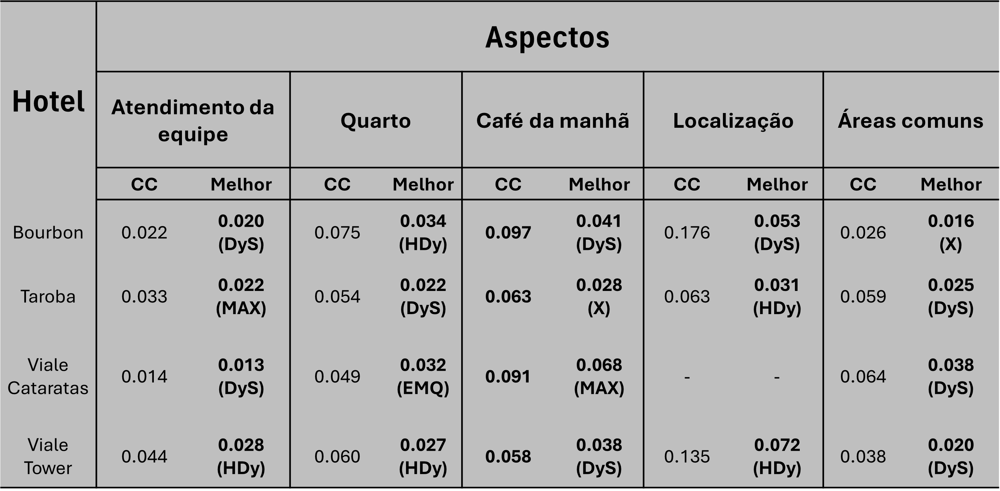
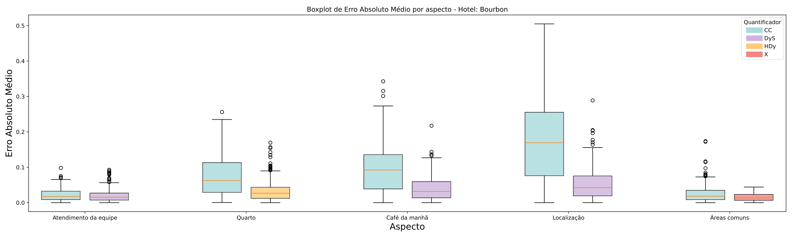
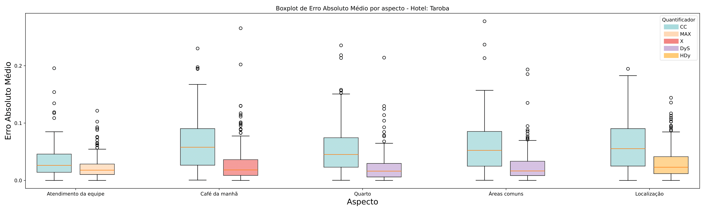

## Como Rodar os Experimentos

Os experimentos utilizam o protocolo APP (Artificial Prevalence Protocol) para avaliar quantificadores sob diferentes distribuições de classe artificialmente geradas, utilizando os métodos da biblioteca de quantificação [mlquantify](https://github.com/luizfernandolj/mlquantify). O fluxo é o seguinte:

- Separe os dados em conjunto de treinamento (L) e conjunto de teste (U), onde \( U \) permanece não rotulado para o quantificador.

- No conjunto de teste \( U \), realize a subamostragem repetida para gerar **50 distribuições artificiais de classes**. Essas distribuições são **uniformemente espaçadas** no intervalo de prevalência entre 0 e 1 para a classe positiva (em problemas binários). Ou seja, as prevalências testadas são:
  
  \[
  \left\{0, \frac{1}{49}, \frac{2}{49}, \frac{3}{49}, ..., 1\right\}
  \]

- Para cada uma dessas 50 distribuições, selecione amostras de cinco tamanhos diferentes que são também **uniformemente espaçados** entre um tamanho mínimo de 25 instâncias e o tamanho máximo disponível no conjunto de teste para o aspecto/categoria avaliada. Por exemplo, se o tamanho máximo disponível for \( N \), os tamanhos testados serão aproximadamente:

  \[
  \left\{25, 25 + \frac{N-25}{4}, 25 + 2 \times \frac{N-25}{4}, 25 + 3 \times \frac{N-25}{4}, N \right\}
  \]

- Para cada combinação de prevalência e tamanho de amostra, realizam-se **3 réplicas independentes** para garantir confiabilidade estatística.

- Para cada execução, é calculado o Erro Absoluto Médio (MAE) entre a distribuição verdadeira de prevalência e a estimada pelo quantificador. As métricas de todas as réplicas são então médias para análise final dos métodos.

Este protocolo permite testar os quantificadores em cenários variados de prevalência e tamanho de dados, simulando condições reais e desafiadoras para a análise robusta de sentimentos.

---

# Análise de sentimento do setor de turismo de Foz do Iguaçu utilizando aprendizado de máquina

Este projeto contém uma análise completa dos dados utilizando notebooks Python. Abaixo estão as os resultados dos experimentos e explicação dos arquivos

## Notebooks

A seguir, uma descrição dos notebooks que compõem a análise:

1. **0. Leitura banco**  
   Responsável por conectar-se ao banco de dados e realizar a extração dos dados para posterior processamento.

2. **1. Descrição dos datasets**  
   Apresenta uma análise exploratória dos dados, mostrando informações sobre as variáveis, tipos e possíveis inconsistências.

3. **2. Padronização das colunas**  
   Realiza a normalização dos nomes das colunas e a correção de formatações para facilitar as análises subsequentes.

4. **3. Balanceamento dos datasets**  
   Implementa técnicas para balanceamento de classes nos datasets, garantindo que os algoritmos de classificação não sofram com vieses.

5. **4. Classificação com RoBERTa**  
   Utiliza o modelo RoBERTa para realizar a classificação dos dados, demonstrando a aplicação de modelos avançados de NLP.

6. **5. Quantificação**  
   Procede à quantificação dos resultados, elaborando métricas e relatórios de performance dos modelos.

7. **6. Análise**  
   Consolida os resultados obtidos em uma análise final, integrando as etapas anteriores e oferecendo insights relevantes para a tomada de decisão.

## Experimentos

### Conjuntos de Dados

Os conjuntos de dados utilizados neste trabalho foram coletados por meio de web scraping em plataformas de avaliação de hotéis como Google, Expedia, Booking e Tripadvisor, focando em hotéis de Foz do Iguaçu. As reviews foram separadas pela categoria aspecto juntamente com o sentimento (positivo ou negativo). O armazenamento foi realizado em banco de dados relacional.

| Hotel           | Total Reviews | Reviews Positivas | Reviews Negativas | Categorias                                            |
|-----------------|---------------|-------------------|-------------------|------------------------------------------------------|
| Bourbon         | 1254          | 1032              | 222               | Quarto, Localização, áreas comuns, Atendimento da equipe, Café da manhã |
| Continental     | 310           | 255               | 55                | Atendimento da equipe, Quarto                         |
| Foz Plaza       | 468           | 371               | 97                | Atendimento da equipe, Quarto, áreas comuns          |
| Nadai           | 812           | 607               | 205               | Atendimento da equipe, Quarto, áreas comuns, Café da manhã |
| Taroba          | 4316          | 3522              | 794               | Atendimento da equipe, Experiência, Café da manhã, Restaurante/Bar, Banheiro, Quarto, Localização, áreas comuns |
| Viale Cataratas | 930           | 656               | 274               | Quarto, áreas comuns, Experiência, Café da manhã, Atendimento da equipe, Restaurante/Bar |
| Viale Tower     | 1324          | 997               | 327               | Localização, Quarto, Café da manhã, Atendimento da equipe, áreas comuns, Experiência |

### Bibliotecas Escolhidas para Quantificação

Comparação entre as bibliotecas Quapy e mlquantify em termos de implementações dos métodos e usabilidade:

| Biblioteca | Aggregative | Threshold Methods | Mixture Models | Non-Aggregative | Total Métodos | Gerenciamento Dinâmico de Classes | Documentação | Usabilidade Alta |
|------------|-------------|-------------------|----------------|-----------------|---------------|---------------------------------|--------------|------------------|
| Quapy      | 9           | 5                 | 3              | 2               | 19            | Não                             | Sim          | Não              |
| mlquantify | 7           | 7                 | 5              | 1               | 20            | Sim                             | Sim          | Sim              |

A biblioteca mlquantify foi escolhida para o desenvolvimento devido à sua versatilidade, suporte ao gerenciamento dinâmico de classes e interface amigável, similar ao padrão do scikit-learn.

### Composição dos Experimentos

Os experimentos foram conduzidos sobre aspectos que continham mais de 100 exemplos para garantir uma avaliação robusta, focando nos aspectos comuns a todos os hotéis:

- Atendimento da equipe
- Quarto
- Café da manhã
- Localização
- Áreas comuns

Utilizou-se o protocolo APP (Artificial Prevalence Protocol) para avaliação dos quantificadores, que consiste em várias repetições com prevalências artificialmente alteradas para medir robustez e precisão.

Para cada combinação de prevalências e tamanhos de amostras (mínimo de 25 instâncias até o total disponível), foram feitas 3 réplicas para confiabilidade dos resultados.

A métrica principal usada para avaliação foi o Erro Absoluto Médio (MAE).

## Resultados dos Experimentos

E para uma melhor analise, os seguintes gráficos foram feitos

Onde para cada hotel, é analisado os aspectos (comentado no resumo) com duas abordagens, a primeira (sempre a esquerda) é o algoritmo classificar e contar (CC) e a direita o melhor encontrado para aquele aspecto.

Os resultados completos se encontram no arquivo quantification_results.csv, e pelo seu tamanho apenas mostraremos um resumo dos resultados na tabela a seguir

A seguir, os resultados obtidos:

| hotel           | QUANTIFIER | aspect                | count | mean        | median      | std         | min         | max         |
|-----------------|------------|-----------------------|-------|-------------|-------------|-------------|-------------|-------------|
| bourbon         | ACC        | Atendimento da equipe | 250   | 0,000259889 | 0,002555763 | 0,237857499 | 0           | 0,011390489 |
| bourbon         | ACC        | Café da manhã         | 250   | 0,008020893 | 0,069328007 | 0,060480271 | 0           | 0,043495358 |
| bourbon         | ACC        | Localização           | 250   | 0,015185604 | 0,0140553   | 0,112949502 | 0           | 0,046181698 |
| bourbon         | ACC        | Quarto                | 250   | 0,040775572 | 0,029999512 | 0,407148674 | 0           | 0,002598892 |
| bourbon         | ACC        | Áreas comuns          | 250   | 0,005848419 | 0,057050937 | 0,040879198 | 0           | 0,017181772 |
| bourbon         | CC         | Atendimento da equipe | 250   | 0,022322753 | 0,173318262 | 0,01722228  | 0           | 0,009815428 |
| bourbon         | CC         | Café da manhã         | 250   | 0,010213282 | 0,009711471 | 0,071679218 | 0           | 0,034265651 |
| bourbon         | CC         | Localização           | 250   | 0,01950152  | 0,187536491 | 0,12296179  | 0           | 0,055096774 |
| bourbon         | CC         | Quarto                | 250   | 0,008118872 | 0,065064935 | 0,611447824 | 4,99559E-05 | 0,029741744 |
| bourbon         | CC         | Áreas comuns          | 250   | 0,002579309 | 0,018433445 | 0,255360197 | 0           | 0,000173771 |
| bourbon         | DyS        | Atendimento da equipe | 250   | 0,020119919 | 0,015304158 | 0,181001212 | 4,42722E-06 | 0,009285008 |
| bourbon         | DyS        | Café da manhã         | 250   | 0,041526572 | 0,032843019 | 0,03388187  | 4,41683E-07 | 0,021728766 |
| bourbon         | DyS        | Localização           | 250   | 0,005279682 | 0,004287698 | 0,000449453 | 4,38338E-07 | 0,028867912 |
| bourbon         | DyS        | Quarto                | 250   | 0,041494339 | 0,033914809 | 0,033897479 | 4,43499E-06 | 0,017946332 |
| bourbon         | DyS        | Áreas comuns          | 250   | 0,035861208 | 0,030366229 | 0,278611918 | 4,39067E-07 | 0,017966304 |
| bourbon         | EMQ        | Atendimento da equipe | 250   | 0,031289569 | 0,025264454 | 0,258504725 | 1,6105E-16  | 0,014703382 |
| bourbon         | EMQ        | Café da manhã         | 250   | 0,011518518 | 0,114768223 | 0,603364797 | 1,96525E-10 | 0,034370296 |
| bourbon         | EMQ        | Localização           | 250   | 0,000417449 | 0,441710793 | 0,21919758  | 3,00857E-11 | 0,083437913 |
| bourbon         | EMQ        | Quarto                | 250   | 0,004538526 | 0,003228098 | 0,046840711 | 2,93948E-08 | 0,028551903 |
| bourbon         | EMQ        | Áreas comuns          | 250   | 0,010526002 | 0,102265817 | 0,057898357 | 1,06569E-15 | 0,029519818 |
| bourbon         | FM         | Atendimento da equipe | 250   | 0,025121128 | 0,214247284 | 0,194870408 | 0           | 0,011177089 |
| bourbon         | FM         | Café da manhã         | 250   | 0,008058975 | 0,007024773 | 0,580065554 | 0           | 0,003359826 |
| bourbon         | FM         | Localização           | 250   | 0,010922317 | 0,084479543 | 0,096540573 | 0           | 0,048256524 |
| bourbon         | FM         | Quarto                | 250   | 0,004797366 | 0,035007051 | 0,447602934 | 0           | 0,026092385 |
| bourbon         | FM         | Áreas comuns          | 250   | 0,044873168 | 0,032062165 | 0,043636214 | 0           | 0,026146109 |
| bourbon         | GPAC       | Atendimento da equipe | 250   | 0,02834726  | 0,002410766 | 0,220359655 | 0           | 0,010858488 |
| bourbon         | GPAC       | Café da manhã         | 250   | 0,008451308 | 0,074244657 | 0,06334885  | 2,48603E-05 | 0,03079546  |
| bourbon         | GPAC       | Localização           | 250   | 0,001936111 | 0,013761876 | 0,213468349 | 0           | 0,098387097 |
| bourbon         | GPAC       | Quarto                | 250   | 0,004433288 | 0,034408218 | 0,407234688 | 0           | 0,023957377 |
| bourbon         | GPAC       | Áreas comuns          | 250   | 0,059497714 | 0,573937515 | 0,396740422 | 0           | 0,0153681   |
| bourbon         | HDy        | Atendimento da equipe | 250   | 0,021658432 | 0,172378385 | 0,171194761 | 0           | 0,008973816 |
| bourbon         | HDy        | Café da manhã         | 250   | 0,004819803 | 0,04031272  | 0,038962191 | 0           | 0,024420303 |
| bourbon         | HDy        | Localização           | 250   | 0,007493924 | 0,006736504 | 0,496356946 | 0           | 0,024817643 |
| bourbon         | HDy        | Quarto                | 250   | 0,000338942 | 0,002569898 | 0,310864491 | 0           | 0,0169532   |
| bourbon         | HDy        | Áreas comuns          | 250   | 0,004166644 | 0,370570837 | 0,031044918 | 0           | 0,001669329 |
| bourbon         | MAX        | Atendimento da equipe | 250   | 0,02580533  | 0,002027981 | 0,19859235  | 0           | 0,008698637 |
| bourbon         | MAX        | Café da manhã         | 250   | 0,008029275 | 0,071141969 | 0,060429887 | 0           | 0,033866667 |
| bourbon         | MAX        | Localização           | 250   | 0,008908192 | 0,00686623  | 0,07835835  | 0           | 0,03840711  |
| bourbon         | MAX        | Quarto                | 250   | 0,004600684 | 0,031915991 | 0,0452186   | 0           | 0,027011005 |
| bourbon         | MAX        | Áreas comuns          | 250   | 0,018012931 | 0,017661371 | 0,114192484 | 0           | 0,004445507 |
| bourbon         | MS         | Atendimento da equipe | 250   | 3,47152E-05 | 0,304691813 | 0,024927336 | 0           | 0,014537978 |
| bourbon         | MS         | Café da manhã         | 250   | 0,048429492 | 0,388675943 | 0,0413952   | 0           | 0,02417452  |
| bourbon         | MS         | Localização           | 250   | 0,022732081 | 0,021256825 | 0,014603527 | 0           | 0,076214862 |
| bourbon         | MS         | Quarto                | 250   | 0,045565772 | 0,003613309 | 0,0425885   | 0           | 0,030026051 |
| bourbon         | MS         | Áreas comuns          | 250   | 0,004931079 | 0,417386216 | 0,035012968 | 0           | 0,017765947 |
| bourbon         | MS2        | Atendimento da equipe | 250   | 0,037545892 | 0,035817846 | 0,266850913 | 0           | 0,01366149  |
| bourbon         | MS2        | Café da manhã         | 250   | 0,045241568 | 3,38566E-05 | 0,444607971 | 0           | 0,027797722 |
| bourbon         | MS2        | Localização           | 250   | 0,008800708 | 0,072696907 | 0,067738963 | 0           | 0,036876337 |
| bourbon         | MS2        | Quarto                | 250   | 0,0467504   | 0,003949232 | 0,042140579 | 1,73991E-05 | 0,027922333 |
| bourbon         | MS2        | Áreas comuns          | 250   | 0,004312023 | 0,004022479 | 0,297921612 | 0           | 0,016492162 |
| bourbon         | PACC       | Atendimento da equipe | 250   | 0,003650563 | 0,328295544 | 0,262476956 | 0           | 0,001419587 |
| bourbon         | PACC       | Café da manhã         | 250   | 0,004373811 | 0,342745291 | 0,038032114 | 0           | 0,024921334 |
| bourbon         | PACC       | Localização           | 250   | 0,008794945 | 0,007641708 | 0,006610242 | 1,26887E-05 | 0,030118542 |
| bourbon         | PACC       | Quarto                | 250   | 0,004891459 | 0,388752081 | 0,388902344 | 3,70779E-07 | 0,019750968 |
| bourbon         | PACC       | Áreas comuns          | 250   | 0,052112606 | 0,492906833 | 0,003584127 | 0           | 0,018215833 |
| bourbon         | PCC        | Atendimento da equipe | 250   | 0,006130386 | 0,006080767 | 0,036337423 | 1,40581E-05 | 0,016942723 |
| bourbon         | PCC        | Café da manhã         | 250   | 0,011300403 | 0,0093696   | 0,079178809 | 9,52352E-06 | 0,032580475 |
| bourbon         | PCC        | Localização           | 250   | 0,00259271  | 0,022344975 | 0,018523214 | 7,35035E-05 | 0,065003897 |
| bourbon         | PCC        | Quarto                | 250   | 0,001161393 | 0,117744477 | 0,069503786 | 0,000115672 | 0,026421971 |
| bourbon         | PCC        | Áreas comuns          | 250   | 0,007716048 | 0,000739748 | 0,466910139 | 0,000299021 | 0,019600113 |
| bourbon         | PWK        | Atendimento da equipe | 250   | 0,00257858  | 0,171598393 | 0,046098612 | 2,56706E-05 | 5E-17       |
| bourbon         | PWK        | Café da manhã         | 250   | 0,010228549 | 0,084086911 | 0,078912542 | 4,30473E-05 | 5E-17       |
| bourbon         | PWK        | Localização           | 250   | 0,022105817 | 0,2078973   | 0,001355263 | 8,0316E-05  | 0,057024358 |
| bourbon         | PWK        | Quarto                | 250   | 0,00853402  | 0,074081481 | 0,061055484 | 2,39005E-05 | 0,033398516 |
| bourbon         | PWK        | Áreas comuns          | 250   | 0,033404307 | 0,016728778 | 0,070637343 | 0           | 0,05        |
| bourbon         | SMM        | Atendimento da equipe | 250   | 0,003980269 | 0,03543087  | 0,301810432 | 0           | 0,016156587 |
| bourbon         | SMM        | Café da manhã         | 250   | 0,004676556 | 0,382740958 | 0,038418586 | 0           | 0,021112273 |
| bourbon         | SMM        | Localização           | 250   | 0,00836742  | 0,006712963 | 0,068517336 | 0           | 0,036001205 |
| bourbon         | SMM        | Quarto                | 250   | 0,005017002 | 0,392621429 | 0,443890301 | 0           | 0,025579487 |
| bourbon         | SMM        | Áreas comuns          | 250   | 0,005393778 | 0,005083789 | 0,034836009 | 0           | 0,01893373  |
| bourbon         | SORD       | Atendimento da equipe | 250   | 0,003388188 | 0,003112951 | 0,234925651 | 0           | 0,010545501 |
| bourbon         | SORD       | Café da manhã         | 250   | 0,043546235 | 0,356087262 | 0,034837829 | 0           | 0,019787122 |
| bourbon         | SORD       | Localização           | 250   | 0,009032176 | 0,079111257 | 0,007283539 | 0           | 0,050920342 |
| bourbon         | SORD       | Quarto                | 250   | 0,046820494 | 0,003453618 | 0,438107716 | 0           | 0,031285714 |
| bourbon         | SORD       | Áreas comuns          | 250   | 0,004589004 | 0,039520852 | 0,324160267 | 0           | 0,01554688  |
| bourbon         | T50        | Atendimento da equipe | 250   | 0,009398813 | 0,007894929 | 0,074882731 | 0           | 0,034796098 |
| bourbon         | T50        | Café da manhã         | 250   | 0,011972399 | 0,008506113 | 0,118451676 | 0           | 0,08442865  |
| bourbon         | T50        | Localização           | 250   | 0,010151464 | 0,080315997 | 0,090265855 | 0           | 0,050355659 |
| bourbon         | T50        | Quarto                | 250   | 0,008028718 | 0,006472613 | 0,073155697 | 0           | 0,0634423   |
| bourbon         | T50        | Áreas comuns          | 250   | 0,0015806   | 0,015501923 | 0,104328014 | 0           | 0,044529543 |
| bourbon         | X_method   | Atendimento da equipe | 250   | 0,002698221 | 0,022985205 | 0,002065544 | 0           | 0,013845921 |
| bourbon         | X_method   | Café da manhã         | 250   | 0,000837148 | 0,007177643 | 0,065328355 | 2,48856E-05 | 0,031476831 |
| bourbon         | X_method   | Localização           | 250   | 0,022312961 | 0,018071099 | 0,175856668 | 0           | 0,098387097 |
| bourbon         | X_method   | Quarto                | 250   | 0,048773431 | 0,036237109 | 0,042910204 | 0           | 0,021687596 |
| bourbon         | X_method   | Áreas comuns          | 250   | 0,01551902  | 0,001366427 | 0,111126809 | 0           | 0,004412044 |
| continental     | ACC        | Atendimento da equipe | 250   | 0,043380864 | 0,04147702  | 0,293357651 | 0           | 0,012699814 |
| continental     | ACC        | Quarto                | 250   | 0,004708981 | 0,003927741 | 0,394837743 | 0           | 0,020912923 |
| continental     | CC         | Atendimento da equipe | 250   | 0,016250178 | 0,012829729 | 0,142400066 | 0           | 0,011740481 |
| continental     | CC         | Quarto                | 250   | 0,00800062  | 0,063311167 | 0,005921338 | 5,04471E-05 | 0,031398303 |
| continental     | DyS        | Atendimento da equipe | 250   | 0,004080396 | 0,003945814 | 0,281277084 | 4,38874E-07 | 0,012444164 |
| continental     | DyS        | Quarto                | 250   | 0,030126245 | 0,002437413 | 0,026683475 | 3,62745E-07 | 0,014924736 |
| continental     | EMQ        | Atendimento da equipe | 250   | 0,003379259 | 0,0026212   | 0,264583411 | 1,15316E-16 | 0,015534248 |
| continental     | EMQ        | Quarto                | 250   | 0,001349863 | 0,013375635 | 0,07696964  | 1,79052E-11 | 0,038304359 |
| continental     | FM         | Atendimento da equipe | 250   | 0,004351591 | 0,004206086 | 0,029253411 | 0           | 0,012923545 |
| continental     | FM         | Quarto                | 250   | 0,008014276 | 0,065608015 | 0,065107556 | 0           | 0,037119762 |
| continental     | GPAC       | Atendimento da equipe | 250   | 0,005095336 | 0,04322774  | 0,087863722 | 0           | 0,098507463 |
| continental     | GPAC       | Quarto                | 250   | 0,004635627 | 0,343883112 | 0,388392894 | 0           | 0,018481797 |
| continental     | HDy        | Atendimento da equipe | 250   | 0,043038111 | 0,000378952 | 0,00339755  | 0           | 0,017912275 |
| continental     | HDy        | Quarto                | 250   | 0,00435823  | 0,339509287 | 0,0036942   | 0           | 0,017192387 |
| continental     | MAX        | Atendimento da equipe | 250   | 0,003696264 | 0,003096705 | 0,270752785 | 0           | 0,009606032 |
| continental     | MAX        | Quarto                | 250   | 0,004963613 | 0,038679113 | 0,042023976 | 0           | 0,024051056 |
| continental     | MS         | Atendimento da equipe | 250   | 0,046856034 | 0,044013285 | 0,033023899 | 0           | 0,013639295 |
| continental     | MS         | Quarto                | 250   | 0,005131562 | 0,00403279  | 0,004059938 | 0           | 0,023722189 |
| continental     | MS2        | Atendimento da equipe | 250   | 0,04701293  | 0,040589652 | 0,032650296 | 0           | 0,001329967 |
| continental     | MS2        | Quarto                | 250   | 0,005719693 | 0,004377754 | 0,052586269 | 0           | 0,034772356 |
| continental     | PACC       | Atendimento da equipe | 250   | 0,052381204 | 0,406667506 | 0,040211667 | 0           | 0,015264236 |
| continental     | PACC       | Quarto                | 250   | 6,70138E-05 | 0,005940783 | 0,051282153 | 0           | 0,024596575 |
| continental     | PCC        | Atendimento da equipe | 250   | 0,005485686 | 0,000488437 | 0,37414005  | 2,75218E-05 | 0,016499162 |
| continental     | PCC        | Quarto                | 250   | 0,011515531 | 0,110472574 | 0,007288918 | 0,00013046  | 0,031691967 |
| continental     | PWK        | Atendimento da equipe | 250   | 0,030159245 | 0,120621383 | 0,086496094 | 0           | 5E-17       |
| continental     | PWK        | Quarto                | 250   | 0,007881554 | 0,006588397 | 0,055220515 | 0,000151341 | 0,025173125 |
| continental     | SMM        | Atendimento da equipe | 250   | 0,051924233 | 0,435423253 | 0,391876817 | 0           | 0,016600468 |
| continental     | SMM        | Quarto                | 250   | 0,006482054 | 0,530192868 | 0,051070169 | 0           | 0,02357171  |
| continental     | SORD       | Atendimento da equipe | 250   | 0,004464519 | 0,403076454 | 0,030500076 | 0           | 0,014112702 |
| continental     | SORD       | Quarto                | 250   | 0,051613483 | 0,00459069  | 0,39342971  | 0           | 0,018181151 |
| continental     | T50        | Atendimento da equipe | 250   | 0,01192646  | 0,008589253 | 0,102548016 | 0           | 0,042861129 |
| continental     | T50        | Quarto                | 250   | 0,000133835 | 0,121298725 | 0,098603863 | 0           | 0,004641137 |
| continental     | X_method   | Atendimento da equipe | 250   | 0,00464139  | 0,040207128 | 0,035089746 | 0           | 0,002385569 |
| continental     | X_method   | Quarto                | 250   | 0,005632432 | 0,048579652 | 0,043784722 | 0           | 0,030983026 |
| foz_plaza       | ACC        | Atendimento da equipe | 250   | 0,005046122 | 0,004017857 | 0,038654825 | 0           | 0,019907458 |
| foz_plaza       | ACC        | Quarto                | 250   | 0,022322472 | 0,019716698 | 0,196341036 | 0           | 0,017726635 |
| foz_plaza       | ACC        | Áreas comuns          | 250   | 0,008806537 | 0,007993201 | 0,064952179 | 0           | 0,028566558 |
| foz_plaza       | CC         | Atendimento da equipe | 250   | 0,00558953  | 0,0049359   | 0,409946875 | 8,03571E-05 | 0,001952679 |
| foz_plaza       | CC         | Quarto                | 250   | 0,00332331  | 0,027076177 | 0,026903415 | 0           | 0,019397858 |
| foz_plaza       | CC         | Áreas comuns          | 250   | 0,000757474 | 0,069285841 | 0,565500653 | 0,000118112 | 0,03183112  |
| foz_plaza       | DyS        | Atendimento da equipe | 250   | 0,027542773 | 0,20389404  | 0,24686815  | 4,38563E-08 | 0,015515041 |
| foz_plaza       | DyS        | Quarto                | 250   | 0,019265919 | 0,015200487 | 0,186385589 | 4,41113E-07 | 0,009902586 |
| foz_plaza       | DyS        | Áreas comuns          | 250   | 0,053260283 | 0,043237183 | 0,459828469 | 4,38338E-06 | 0,035211871 |
| foz_plaza       | EMQ        | Atendimento da equipe | 250   | 0,002999328 | 0,234379732 | 0,246496073 | 5,30504E-12 | 0,015362865 |
| foz_plaza       | EMQ        | Quarto                | 250   | 0,00358318  | 0,029415633 | 0,030595287 | 1,75661E-12 | 0,016752986 |
| foz_plaza       | EMQ        | Áreas comuns          | 250   | 0,007879676 | 0,006729372 | 0,580471813 | 1,19566E-11 | 0,034133727 |
| foz_plaza       | FM         | Atendimento da equipe | 250   | 0,004037646 | 0,03296067  | 0,032526076 | 0           | 0,0140625   |
| foz_plaza       | FM         | Quarto                | 250   | 0,026870998 | 0,204100941 | 0,216742689 | 0           | 0,009755474 |
| foz_plaza       | FM         | Áreas comuns          | 250   | 0,006882503 | 0,0060237   | 0,049648172 | 0           | 0,025667778 |
| foz_plaza       | GPAC       | Atendimento da equipe | 250   | 0,005029653 | 0,004017857 | 0,039878547 | 0           | 0,000164196 |
| foz_plaza       | GPAC       | Quarto                | 250   | 0,005326885 | 0,018530915 | 0,169801676 | 0           | 0,000990099 |
| foz_plaza       | GPAC       | Áreas comuns          | 250   | 0,008468545 | 0,007439653 | 0,062322622 | 0           | 0,026487462 |
| foz_plaza       | HDy        | Atendimento da equipe | 250   | 0,00352125  | 0,003088728 | 0,261720433 | 0           | 0,013761161 |
| foz_plaza       | HDy        | Quarto                | 250   | 0,007111134 | 0,064811073 | 0,49348523  | 0           | 0,024025056 |
| foz_plaza       | HDy        | Áreas comuns          | 250   | 0,003828302 | 0,31122449  | 0,293356013 | 0           | 0,013603522 |
| foz_plaza       | MAX        | Atendimento da equipe | 250   | 0,003904161 | 0,002897935 | 0,032848188 | 0           | 0,015645149 |
| foz_plaza       | MAX        | Quarto                | 250   | 0,023853539 | 0,001897743 | 0,21249095  | 0           | 0,013752396 |
| foz_plaza       | MAX        | Áreas comuns          | 250   | 0,007340195 | 0,0060237   | 0,568166667 | 0           | 0,031505599 |
| foz_plaza       | MS         | Atendimento da equipe | 250   | 0,033592735 | 0,027208371 | 0,254493782 | 0           | 0,015813813 |
| foz_plaza       | MS         | Quarto                | 250   | 0,026869784 | 0,192754305 | 0,283343524 | 0           | 0,021418468 |
| foz_plaza       | MS         | Áreas comuns          | 250   | 0,007816255 | 0,006693076 | 0,564244131 | 0           | 0,032126399 |
| foz_plaza       | MS2        | Atendimento da equipe | 250   | 0,035529738 | 0,000274718 | 0,302746749 | 0           | 0,018067454 |
| foz_plaza       | MS2        | Quarto                | 250   | 0,026218218 | 0,017964611 | 0,282293651 | 0           | 0,022962415 |
| foz_plaza       | MS2        | Áreas comuns          | 250   | 0,007710686 | 0,071621522 | 0,567945591 | 0           | 0,025501531 |
| foz_plaza       | PACC       | Atendimento da equipe | 250   | 0,003676133 | 0,031306124 | 0,282479272 | 0           | 0,014947358 |
| foz_plaza       | PACC       | Quarto                | 250   | 0,003897647 | 0,033097265 | 0,294690677 | 0           | 0,014766899 |
| foz_plaza       | PACC       | Áreas comuns          | 250   | 9,06408E-05 | 0,0080316   | 0,006580311 | 0           | 0,027889483 |
| foz_plaza       | PCC        | Atendimento da equipe | 250   | 0,007306407 | 0,062022748 | 0,049475716 | 6,96699E-05 | 0,021443907 |
| foz_plaza       | PCC        | Quarto                | 250   | 8,62103E-05 | 0,082404786 | 0,053443936 | 8,74505E-07 | 0,023098257 |
| foz_plaza       | PCC        | Áreas comuns          | 250   | 0,010284778 | 0,009957066 | 0,006640596 | 7,62581E-05 | 0,028530745 |
| foz_plaza       | PWK        | Atendimento da equipe | 250   | 0,005757533 | 0,04701427  | 0,049573601 | 0           | 0,05        |
| foz_plaza       | PWK        | Quarto                | 250   | 0,004969853 | 0,030674167 | 0,081783208 | 4,04122E-05 | 5E-17       |
| foz_plaza       | PWK        | Áreas comuns          | 250   | 0,008065467 | 0,073311695 | 0,055942868 | 9,87492E-05 | 0,027129997 |
| foz_plaza       | SMM        | Atendimento da equipe | 250   | 0,003743353 | 0,331935372 | 0,29267267  | 0           | 0,012662271 |
| foz_plaza       | SMM        | Quarto                | 250   | 0,036857327 | 0,033289766 | 0,026786054 | 0           | 0,01438146  |
| foz_plaza       | SMM        | Áreas comuns          | 250   | 0,009001473 | 0,0080316   | 0,06858169  | 0           | 0,031533476 |
| foz_plaza       | SORD       | Atendimento da equipe | 250   | 0,003305973 | 0,029430804 | 0,265284396 | 0           | 0,015127232 |
| foz_plaza       | SORD       | Quarto                | 250   | 0,002523096 | 0,001798343 | 0,023608733 | 0           | 0,013053142 |
| foz_plaza       | SORD       | Áreas comuns          | 250   | 0,000793787 | 0,072886768 | 0,539750634 | 0           | 0,02728736  |
| foz_plaza       | T50        | Atendimento da equipe | 250   | 0,010359611 | 0,008660169 | 0,082269696 | 0           | 0,046205357 |
| foz_plaza       | T50        | Quarto                | 250   | 0,007558034 | 0,0592264   | 0,064837681 | 0           | 0,034075958 |
| foz_plaza       | T50        | Áreas comuns          | 250   | 0,016073586 | 0,00140553  | 0,113126462 | 0           | 0,048189598 |
| foz_plaza       | X_method   | Atendimento da equipe | 250   | 0,004205611 | 0,003553547 | 0,3192623   | 0           | 0,018330887 |
| foz_plaza       | X_method   | Quarto                | 250   | 0,002393787 | 0,001870962 | 0,20933513  | 0           | 0,011044732 |
| foz_plaza       | X_method   | Áreas comuns          | 250   | 0,010051585 | 0,098350216 | 0,069631966 | 0           | 0,033277424 |
| nadai           | ACC        | Atendimento da equipe | 250   | 0,004640895 | 0,004364002 | 0,029574615 | 0           | 0,001390864 |
| nadai           | ACC        | Café da manhã         | 250   | 0,006239785 | 0,049985574 | 0,04900316  | 0           | 0,002808742 |
| nadai           | ACC        | Quarto                | 250   | 0,029799849 | 0,027507062 | 0,236092538 | 0           | 0,001297318 |
| nadai           | ACC        | Áreas comuns          | 250   | 0,008895619 | 0,069166319 | 0,007243286 | 0           | 0,050695477 |
| nadai           | CC         | Atendimento da equipe | 250   | 0,025981945 | 0,001928453 | 0,243103425 | 0           | 0,013999012 |
| nadai           | CC         | Café da manhã         | 250   | 0,009142264 | 0,07833595  | 0,068244887 | 5,91006E-05 | 0,038533567 |
| nadai           | CC         | Quarto                | 250   | 0,025835411 | 0,01912261  | 0,212936787 | 1,11022E-17 | 0,011743532 |
| nadai           | CC         | Áreas comuns          | 250   | 0,010641507 | 0,090084184 | 0,076792598 | 5,10204E-05 | 0,035388776 |
| nadai           | DyS        | Atendimento da equipe | 250   | 0,02468789  | 0,202394881 | 0,181435982 | 4,40978E-07 | 8,96765E-05 |
| nadai           | DyS        | Café da manhã         | 250   | 0,003808852 | 0,33730015  | 0,029630251 | 1,56029E-06 | 0,016409589 |
| nadai           | DyS        | Quarto                | 250   | 0,021576123 | 0,016653641 | 0,191960538 | 3,8625E-07  | 0,011452949 |
| nadai           | DyS        | Áreas comuns          | 250   | 0,004398501 | 0,003454954 | 0,036182148 | 4,39955E-07 | 0,01906807  |
| nadai           | EMQ        | Atendimento da equipe | 250   | 0,004278483 | 0,403996635 | 0,289862807 | 2,7929E-17  | 0,014487626 |
| nadai           | EMQ        | Café da manhã         | 250   | 0,00489994  | 0,40748038  | 0,413342537 | 2,86898E-11 | 0,021812076 |
| nadai           | EMQ        | Quarto                | 250   | 0,006638834 | 0,607310575 | 0,048384711 | 8,28051E-12 | 0,023871601 |
| nadai           | EMQ        | Áreas comuns          | 250   | 0,006167323 | 0,466594741 | 0,052414627 | 2,85325E-09 | 0,028320412 |
| nadai           | FM         | Atendimento da equipe | 250   | 0,02810454  | 0,023711943 | 0,207961996 | 0           | 0,012745011 |
| nadai           | FM         | Café da manhã         | 250   | 0,042805482 | 0,031960951 | 0,396277897 | 0           | 0,023086843 |
| nadai           | FM         | Quarto                | 250   | 0,02913097  | 0,022233121 | 0,243329335 | 0           | 0,020350651 |
| nadai           | FM         | Áreas comuns          | 250   | 0,010018205 | 0,087830117 | 0,007787865 | 0           | 0,004263425 |
| nadai           | GPAC       | Atendimento da equipe | 250   | 0,047845208 | 0,004039983 | 0,065465857 | 0           | 0,0969596   |
| nadai           | GPAC       | Café da manhã         | 250   | 0,059654902 | 0,051319125 | 0,04806929  | 0           | 0,02411303  |
| nadai           | GPAC       | Quarto                | 250   | 0,003238487 | 0,002359505 | 0,065329111 | 0           | 0,099212598 |
| nadai           | GPAC       | Áreas comuns          | 250   | 0,001007629 | 0,089102193 | 0,087092257 | 0           | 0,096734694 |
| nadai           | HDy        | Atendimento da equipe | 250   | 0,02670833  | 0,241894002 | 0,191166043 | 0           | 0,009514161 |
| nadai           | HDy        | Café da manhã         | 250   | 0,039160766 | 0,032401884 | 0,275142106 | 0           | 0,015251491 |
| nadai           | HDy        | Quarto                | 250   | 0,040859393 | 0,031940382 | 0,035236991 | 0           | 0,023092238 |
| nadai           | HDy        | Áreas comuns          | 250   | 0,033080041 | 0,002453635 | 0,291074701 | 0           | 0,019276403 |
| nadai           | MAX        | Atendimento da equipe | 250   | 0,000216001 | 0,002012663 | 0,160563237 | 0           | 0,001116793 |
| nadai           | MAX        | Café da manhã         | 250   | 0,042261665 | 0,00353193  | 0,033092799 | 0           | 0,014434722 |
| nadai           | MAX        | Quarto                | 250   | 0,023695332 | 0,018035908 | 0,212456278 | 0           | 0,013862873 |
| nadai           | MAX        | Áreas comuns          | 250   | 0,007839788 | 0,062439703 | 0,602255039 | 0           | 0,035860878 |
| nadai           | MS         | Atendimento da equipe | 250   | 0,002909779 | 0,246564489 | 0,207346953 | 0           | 0,010170206 |
| nadai           | MS         | Café da manhã         | 250   | 0,00412276  | 0,306742761 | 0,038537318 | 0           | 0,024581649 |
| nadai           | MS         | Quarto                | 250   | 0,024995316 | 0,002024747 | 0,022601616 | 0           | 0,012410118 |
| nadai           | MS         | Áreas comuns          | 250   | 0,005764803 | 0,424133548 | 0,055767059 | 0           | 0,040892874 |
| nadai           | MS2        | Atendimento da equipe | 250   | 0,029025935 | 0,240837391 | 0,218264213 | 0           | 0,010595549 |
| nadai           | MS2        | Café da manhã         | 250   | 0,038409263 | 0,000315855 | 0,032772089 | 0           | 0,020115089 |
| nadai           | MS2        | Quarto                | 250   | 0,025867416 | 0,20312624  | 0,219048815 | 0           | 0,013868521 |
| nadai           | MS2        | Áreas comuns          | 250   | 0,005337559 | 0,004048698 | 0,046483155 | 0           | 0,029166873 |
| nadai           | PACC       | Atendimento da equipe | 250   | 0,030754902 | 0,026264808 | 0,022144627 | 0           | 0,009678293 |
| nadai           | PACC       | Café da manhã         | 250   | 0,004973829 | 0,040037092 | 0,40362127  | 0           | 0,0196068   |
| nadai           | PACC       | Quarto                | 250   | 0,002871644 | 0,252040905 | 0,219359513 | 0           | 0,013208802 |
| nadai           | PACC       | Áreas comuns          | 250   | 0,00646613  | 0,005541582 | 0,462508798 | 0           | 0,024570828 |
| nadai           | PCC        | Atendimento da equipe | 250   | 0,005364568 | 0,004934892 | 0,033308328 | 4,39672E-07 | 0,014382445 |
| nadai           | PCC        | Café da manhã         | 250   | 0,000948995 | 0,080042548 | 0,065365421 | 3,0933E-05  | 0,026597261 |
| nadai           | PCC        | Quarto                | 250   | 0,00939945  | 0,095448002 | 0,053558    | 5,73554E-05 | 0,02286361  |
| nadai           | PCC        | Áreas comuns          | 250   | 0,01309174  | 0,01294048  | 0,08396094  | 0,000117425 | 0,034556544 |
| nadai           | PWK        | Atendimento da equipe | 250   | 0,003460221 | 0,017303436 | 0,007104856 | 2,08247E-05 | 5E-17       |
| nadai           | PWK        | Café da manhã         | 250   | 0,000979675 | 0,091463594 | 0,067526261 | 1,88383E-05 | 0,000294983 |
| nadai           | PWK        | Quarto                | 250   | 0,002923321 | 0,02272216  | 0,036927347 | 2,02475E-05 | 5E-17       |
| nadai           | PWK        | Áreas comuns          | 250   | 0,001084904 | 0,009704474 | 0,007745507 | 5,30344E-05 | 0,034182692 |
| nadai           | SMM        | Atendimento da equipe | 250   | 0,003205873 | 0,003028115 | 0,022474824 | 0           | 0,013690532 |
| nadai           | SMM        | Café da manhã         | 250   | 0,004610218 | 0,038816799 | 0,034664387 | 0           | 0,018868662 |
| nadai           | SMM        | Quarto                | 250   | 0,030947709 | 0,002438633 | 0,274489832 | 0           | 0,015992642 |
| nadai           | SMM        | Áreas comuns          | 250   | 0,006026723 | 0,005301426 | 0,043115624 | 0           | 0,022795319 |
| nadai           | SORD       | Atendimento da equipe | 250   | 0,003218574 | 0,027471887 | 0,224642669 | 0           | 0,01205935  |
| nadai           | SORD       | Café da manhã         | 250   | 0,000441518 | 0,037576138 | 0,034763094 | 0           | 0,020636735 |
| nadai           | SORD       | Quarto                | 250   | 0,023695208 | 0,002024747 | 0,019270293 | 0           | 0,012269966 |
| nadai           | SORD       | Áreas comuns          | 250   | 0,005114605 | 0,039399235 | 0,460722589 | 0           | 0,029504082 |
| nadai           | T50        | Atendimento da equipe | 250   | 0,008532031 | 0,070955654 | 0,071778677 | 0           | 0,048936034 |
| nadai           | T50        | Café da manhã         | 250   | 0,00703036  | 0,005596378 | 0,056262969 | 0           | 0,026556484 |
| nadai           | T50        | Quarto                | 250   | 0,010431938 | 0,084612037 | 0,084385241 | 0           | 0,038626014 |
| nadai           | T50        | Áreas comuns          | 250   | 0,019832343 | 0,001681095 | 0,145486004 | 0           | 0,074923425 |
| nadai           | X_method   | Atendimento da equipe | 250   | 0,003229123 | 0,307002124 | 0,022691635 | 0           | 0,008849571 |
| nadai           | X_method   | Café da manhã         | 250   | 0,05521181  | 0,046779699 | 0,431927154 | 0           | 0,022118591 |
| nadai           | X_method   | Quarto                | 250   | 0,030726667 | 0,003008246 | 0,215336585 | 0           | 0,010123735 |
| nadai           | X_method   | Áreas comuns          | 250   | 0,009345042 | 0,083499848 | 0,007042888 | 0           | 0,041313776 |
| taroba          | ACC        | Atendimento da equipe | 250   | 0,002527503 | 0,185954422 | 0,026336753 | 0           | 0,024508808 |
| taroba          | ACC        | Banheiro              | 250   | 0,03512214  | 0,0027515   | 0,030865398 | 0           | 0,022545612 |
| taroba          | ACC        | Café da manhã         | 250   | 0,033500778 | 0,023430923 | 0,337762011 | 0           | 0,021683274 |
| taroba          | ACC        | Experiência           | 250   | 0,003733968 | 0,03302798  | 0,025345085 | 0           | 0,011413484 |
| taroba          | ACC        | Localização           | 250   | 0,040045521 | 0,003293431 | 0,03312826  | 0           | 0,01990786  |
| taroba          | ACC        | Quarto                | 250   | 0,02479697  | 0,181580627 | 0,271189422 | 0           | 0,001828238 |
| taroba          | ACC        | Restaurante/Bar       | 250   | 0,030417578 | 0,025001991 | 0,241471065 | 0           | 0,013973084 |
| taroba          | ACC        | Áreas comuns          | 250   | 0,004237532 | 0,032958716 | 0,032124554 | 0           | 0,01336092  |
| taroba          | CC         | Atendimento da equipe | 250   | 0,003432355 | 0,027137729 | 0,27259725  | 0           | 0,01955902  |
| taroba          | CC         | Banheiro              | 250   | 0,004570474 | 0,038360764 | 0,386165402 | 0           | 0,01983871  |
| taroba          | CC         | Café da manhã         | 250   | 0,000661346 | 0,595661325 | 0,047979344 | 5,97729E-05 | 0,002300538 |
| taroba          | CC         | Experiência           | 250   | 0,004701351 | 0,003640656 | 0,037819277 | 5,19352E-05 | 0,02513968  |
| taroba          | CC         | Localização           | 250   | 0,000637715 | 0,005572279 | 0,046384411 | 0           | 0,019457277 |
| taroba          | CC         | Quarto                | 250   | 0,000574211 | 0,005022667 | 0,043849742 | 2,44385E-05 | 0,027859838 |
| taroba          | CC         | Restaurante/Bar       | 250   | 0,005442613 | 0,042568012 | 0,044678611 | 0           | 0,023755657 |
| taroba          | CC         | Áreas comuns          | 250   | 0,061480811 | 0,054231397 | 0,043638088 | 2,51158E-05 | 0,027748922 |
| taroba          | DyS        | Atendimento da equipe | 250   | 0,026825773 | 0,211850105 | 0,24731314  | 4,44778E-07 | 0,014612645 |
| taroba          | DyS        | Banheiro              | 250   | 0,00023271  | 0,169388688 | 0,206919656 | 2,48529E-07 | 0,008769291 |
| taroba          | DyS        | Café da manhã         | 250   | 0,029254223 | 0,002166733 | 0,02737435  | 4,4366E-06  | 0,016194559 |
| taroba          | DyS        | Experiência           | 250   | 0,019304263 | 0,132739629 | 0,195876866 | 3,01193E-07 | 0,015025752 |
| taroba          | DyS        | Localização           | 250   | 0,003596457 | 0,309518709 | 0,294471601 | 4,40628E-07 | 0,022186993 |
| taroba          | DyS        | Quarto                | 250   | 0,022509862 | 0,016209364 | 0,252996551 | 8,60206E-08 | 0,021402588 |
| taroba          | DyS        | Restaurante/Bar       | 250   | 0,018877183 | 0,013431738 | 0,19138291  | 4,42493E-07 | 0,011995481 |
| taroba          | DyS        | Áreas comuns          | 250   | 0,000246145 | 0,001670208 | 0,025654458 | 4,44119E-07 | 0,019343627 |
| taroba          | EMQ        | Atendimento da equipe | 250   | 0,022959071 | 0,016931763 | 0,2643825   | 3,41788E-12 | 0,020341276 |
| taroba          | EMQ        | Banheiro              | 250   | 0,015432208 | 0,160576559 | 0,074639809 | 2,4846E-16  | 0,038050495 |
| taroba          | EMQ        | Café da manhã         | 250   | 0,006304392 | 0,00591121  | 0,386698434 | 1,66125E-08 | 0,024317214 |
| taroba          | EMQ        | Experiência           | 250   | 0,027194352 | 0,221332679 | 0,221594118 | 6,60424E-12 | 0,012232924 |
| taroba          | EMQ        | Localização           | 250   | 0,003464795 | 0,037354813 | 0,166041119 | 0           | 0,073301728 |
| taroba          | EMQ        | Quarto                | 250   | 0,003766532 | 0,031475458 | 0,032076265 | 2,08747E-09 | 0,022757709 |
| taroba          | EMQ        | Restaurante/Bar       | 250   | 0,008945194 | 0,008901109 | 0,045428209 | 2,78857E-18 | 0,029952537 |
| taroba          | EMQ        | Áreas comuns          | 250   | 0,000794323 | 0,075678478 | 0,004470211 | 1,83222E-11 | 0,035066707 |
| taroba          | FM         | Atendimento da equipe | 250   | 0,029360659 | 0,002281408 | 0,276018487 | 0           | 0,016037323 |
| taroba          | FM         | Banheiro              | 250   | 0,056048834 | 0,04262663  | 0,051191894 | 0           | 0,02725721  |
| taroba          | FM         | Café da manhã         | 250   | 0,00360016  | 0,002466587 | 0,036456326 | 0           | 0,026487971 |
| taroba          | FM         | Experiência           | 250   | 0,002438965 | 0,180559803 | 0,228497024 | 0           | 0,001310226 |
| taroba          | FM         | Localização           | 250   | 0,008175123 | 6,71691E-05 | 0,006497466 | 0           | 0,038349406 |
| taroba          | FM         | Quarto                | 250   | 0,028040369 | 0,203870561 | 0,306431923 | 0           | 0,024508288 |
| taroba          | FM         | Restaurante/Bar       | 250   | 0,030944305 | 0,019608487 | 0,003092355 | 0           | 0,017969928 |
| taroba          | FM         | Áreas comuns          | 250   | 0,028214985 | 0,00189846  | 0,289312235 | 0           | 0,020169461 |
| taroba          | GPAC       | Atendimento da equipe | 250   | 0,032946576 | 0,001814042 | 0,08974122  | 0           | 0,099832496 |
| taroba          | GPAC       | Banheiro              | 250   | 0,003614122 | 0,002655032 | 0,033360914 | 0           | 0,019192398 |
| taroba          | GPAC       | Café da manhã         | 250   | 0,00368038  | 0,26746928  | 0,035726366 | 0           | 0,02309515  |
| taroba          | GPAC       | Experiência           | 250   | 0,042254402 | 0,036418705 | 0,064708425 | 0           | 0,009722265 |
| taroba          | GPAC       | Localização           | 250   | 0,006700478 | 0,035595422 | 0,15877806  | 0           | 0,00989011  |
| taroba          | GPAC       | Quarto                | 250   | 0,026653533 | 0,019205939 | 0,256787918 | 0           | 0,015858523 |
| taroba          | GPAC       | Restaurante/Bar       | 250   | 0,00373223  | 0,022737009 | 0,088958969 | 0           | 0,099319728 |
| taroba          | GPAC       | Áreas comuns          | 250   | 0,000403439 | 0,333706156 | 0,321848275 | 0           | 0,015399236 |
| taroba          | HDy        | Atendimento da equipe | 250   | 0,00031664  | 0,000226151 | 0,033755297 | 0           | 0,023603254 |
| taroba          | HDy        | Banheiro              | 250   | 0,00337586  | 0,002859406 | 0,268684513 | 0           | 0,013411373 |
| taroba          | HDy        | Café da manhã         | 250   | 0,030261423 | 0,020678422 | 0,003238968 | 0           | 0,018575015 |
| taroba          | HDy        | Experiência           | 250   | 0,023101317 | 0,019090072 | 0,020463394 | 0           | 0,012537671 |
| taroba          | HDy        | Localização           | 250   | 0,030606863 | 0,023009643 | 0,026818463 | 0           | 0,014411303 |
| taroba          | HDy        | Quarto                | 250   | 0,025833483 | 0,019398023 | 0,024228099 | 0           | 0,01234142  |
| taroba          | HDy        | Restaurante/Bar       | 250   | 0,002609758 | 0,182930723 | 0,026803571 | 0           | 0,001640802 |
| taroba          | HDy        | Áreas comuns          | 250   | 0,033765392 | 0,272098114 | 0,266424949 | 0           | 0,012826756 |
| taroba          | MAX        | Atendimento da equipe | 250   | 0,0022556   | 0,179217722 | 0,187640085 | 0           | 0,001214764 |
| taroba          | MAX        | Banheiro              | 250   | 0,028029947 | 0,00227817  | 0,251497624 | 0           | 0,01645253  |
| taroba          | MAX        | Café da manhã         | 250   | 0,002916961 | 0,002085659 | 0,299848526 | 0           | 0,025240927 |
| taroba          | MAX        | Experiência           | 250   | 0,001957409 | 0,151227567 | 0,187622276 | 0           | 0,010431437 |
| taroba          | MAX        | Localização           | 250   | 0,004090521 | 0,003496317 | 0,30694175  | 0           | 0,018789922 |
| taroba          | MAX        | Quarto                | 250   | 0,002707411 | 0,002036538 | 0,002525506 | 0           | 0,016402786 |
| taroba          | MAX        | Restaurante/Bar       | 250   | 0,002481539 | 0,001873729 | 0,022427517 | 0           | 0,013376497 |
| taroba          | MAX        | Áreas comuns          | 250   | 0,026108637 | 0,001720148 | 0,288504931 | 0           | 0,020286549 |
| taroba          | MS         | Atendimento da equipe | 250   | 0,029796619 | 0,026370113 | 0,211814441 | 0           | 0,013844608 |
| taroba          | MS         | Banheiro              | 250   | 0,044774966 | 0,038658977 | 0,037184682 | 0           | 0,018219223 |
| taroba          | MS         | Café da manhã         | 250   | 0,00379351  | 0,031599731 | 0,311515653 | 0           | 0,015636757 |
| taroba          | MS         | Experiência           | 250   | 0,026538276 | 0,002025472 | 0,002291183 | 0           | 0,014383585 |
| taroba          | MS         | Localização           | 250   | 0,003522817 | 0,028734813 | 0,296273039 | 0           | 0,013843457 |
| taroba          | MS         | Quarto                | 250   | 0,027390518 | 0,000203119 | 0,295278867 | 0           | 0,017619091 |
| taroba          | MS         | Restaurante/Bar       | 250   | 0,02376668  | 0,002026933 | 0,020234915 | 0           | 0,014051826 |
| taroba          | MS         | Áreas comuns          | 250   | 0,002514347 | 0,001876002 | 0,023561609 | 0           | 0,001219427 |
| taroba          | MS2        | Atendimento da equipe | 250   | 0,002799756 | 0,002439601 | 0,204003316 | 0           | 0,015741962 |
| taroba          | MS2        | Banheiro              | 250   | 0,004912499 | 0,004048716 | 0,404406898 | 0           | 0,02624487  |
| taroba          | MS2        | Café da manhã         | 250   | 0,003294654 | 0,026732211 | 0,288193951 | 0           | 0,016085055 |
| taroba          | MS2        | Experiência           | 250   | 0,026910291 | 0,00209499  | 0,226832351 | 0           | 0,001295222 |
| taroba          | MS2        | Localização           | 250   | 0,032278824 | 0,243870664 | 0,288341059 | 0           | 0,01523888  |
| taroba          | MS2        | Quarto                | 250   | 0,002895907 | 0,019621303 | 0,003439153 | 0           | 0,021021082 |
| taroba          | MS2        | Restaurante/Bar       | 250   | 0,023646651 | 0,001788667 | 0,212272193 | 0           | 0,0118398   |
| taroba          | MS2        | Áreas comuns          | 250   | 0,028400752 | 0,001977002 | 0,032090188 | 0           | 0,021985051 |
| taroba          | PACC       | Atendimento da equipe | 250   | 0,003293639 | 0,002926952 | 0,252173902 | 0           | 0,020335173 |
| taroba          | PACC       | Banheiro              | 250   | 0,005366975 | 0,043319637 | 0,042326544 | 0           | 0,020840276 |
| taroba          | PACC       | Café da manhã         | 250   | 0,040939958 | 0,032296821 | 0,034536952 | 0           | 0,020913267 |
| taroba          | PACC       | Experiência           | 250   | 0,002725121 | 0,211665554 | 0,22765044  | 0           | 0,010710588 |
| taroba          | PACC       | Localização           | 250   | 0,00376165  | 0,031507982 | 0,300591795 | 0           | 0,015150723 |
| taroba          | PACC       | Quarto                | 250   | 0,025096878 | 0,001792067 | 0,025152116 | 0           | 0,014712861 |
| taroba          | PACC       | Restaurante/Bar       | 250   | 0,003210455 | 0,028312599 | 0,236341421 | 2,25277E-05 | 0,013374141 |
| taroba          | PACC       | Áreas comuns          | 250   | 0,029217052 | 0,225653648 | 0,26295773  | 0           | 0,014558052 |
| taroba          | PCC        | Atendimento da equipe | 250   | 0,007133242 | 0,063183894 | 0,048113108 | 6,96769E-05 | 0,01915294  |
| taroba          | PCC        | Banheiro              | 250   | 0,008980026 | 0,088689979 | 0,052964416 | 1,73503E-05 | 0,021599618 |
| taroba          | PCC        | Café da manhã         | 250   | 0,008386984 | 0,073276522 | 0,057679777 | 8,65442E-06 | 0,023711154 |
| taroba          | PCC        | Experiência           | 250   | 0,000819432 | 0,069435445 | 0,061381543 | 1,19799E-06 | 0,002477103 |
| taroba          | PCC        | Localização           | 250   | 0,00927197  | 0,088549537 | 0,055514228 | 2,80885E-07 | 0,023194958 |
| taroba          | PCC        | Quarto                | 250   | 0,009798635 | 0,009387515 | 0,579668145 | 0,000167577 | 0,026048327 |
| taroba          | PCC        | Restaurante/Bar       | 250   | 0,007324267 | 0,006845213 | 0,048012281 | 9,54053E-05 | 0,021006605 |
| taroba          | PCC        | Áreas comuns          | 250   | 0,010244807 | 0,010286498 | 0,610830771 | 7,15643E-05 | 0,024411671 |
| taroba          | PWK        | Atendimento da equipe | 250   | 0,00367599  | 0,278528698 | 0,41344789  | 6,83691E-07 | 5E-17       |
| taroba          | PWK        | Banheiro              | 250   | 0,049849997 | 0,004048716 | 0,047364901 | 0           | 0,05        |
| taroba          | PWK        | Café da manhã         | 250   | 0,006936854 | 0,005887627 | 0,048746857 | 0,000162582 | 0,023736999 |
| taroba          | PWK        | Experiência           | 250   | 0,005063764 | 0,003754795 | 0,046867401 | 0           | 0,05        |
| taroba          | PWK        | Localização           | 250   | 0,007417641 | 0,005400078 | 0,084505826 | 2,24266E-05 | 5E-17       |
| taroba          | PWK        | Quarto                | 250   | 0,005580602 | 0,049553759 | 0,040716736 | 2,99491E-05 | 0,023786763 |
| taroba          | PWK        | Restaurante/Bar       | 250   | 0,005833269 | 0,004112832 | 0,070061576 | 3,68533E-05 | 5E-17       |
| taroba          | PWK        | Áreas comuns          | 250   | 0,000650325 | 0,619887072 | 0,044424548 | 2,39339E-05 | 0,021889912 |
| taroba          | SMM        | Atendimento da equipe | 250   | 0,003194023 | 0,028972811 | 0,225442736 | 0           | 0,013420154 |
| taroba          | SMM        | Banheiro              | 250   | 0,005730501 | 0,004863249 | 0,04663427  | 0           | 0,002643113 |
| taroba          | SMM        | Café da manhã         | 250   | 0,003925099 | 0,003408552 | 0,306169739 | 0           | 0,021293807 |
| taroba          | SMM        | Experiência           | 250   | 0,002952137 | 0,023053575 | 0,239564289 | 0           | 0,010367268 |
| taroba          | SMM        | Localização           | 250   | 0,004288691 | 0,003769541 | 0,031483779 | 0           | 0,014661944 |
| taroba          | SMM        | Quarto                | 250   | 0,00273151  | 0,020202146 | 0,002904637 | 0           | 0,022812206 |
| taroba          | SMM        | Restaurante/Bar       | 250   | 0,031878124 | 0,002976413 | 0,219976211 | 0           | 0,001271446 |
| taroba          | SMM        | Áreas comuns          | 250   | 0,002789044 | 0,019988903 | 0,277723502 | 0           | 0,0191916   |
| taroba          | SORD       | Atendimento da equipe | 250   | 0,002968978 | 0,002587495 | 0,23098281  | 0           | 0,014322907 |
| taroba          | SORD       | Banheiro              | 250   | 0,003744901 | 0,297580645 | 0,031810143 | 0           | 0,017875082 |
| taroba          | SORD       | Café da manhã         | 250   | 0,003450482 | 0,271309026 | 0,312408591 | 0           | 0,017640167 |
| taroba          | SORD       | Experiência           | 250   | 0,002315925 | 0,172165107 | 0,021177635 | 0           | 0,01257818  |
| taroba          | SORD       | Localização           | 250   | 0,003262202 | 0,024927114 | 0,031324051 | 0           | 0,021516035 |
| taroba          | SORD       | Quarto                | 250   | 0,026239569 | 0,001934711 | 0,026603169 | 0           | 0,018104822 |
| taroba          | SORD       | Restaurante/Bar       | 250   | 0,024845337 | 0,002168819 | 0,203231376 | 0           | 0,013519645 |
| taroba          | SORD       | Áreas comuns          | 250   | 0,025625844 | 0,001851284 | 0,263509236 | 0           | 0,017170154 |
| taroba          | T50        | Atendimento da equipe | 250   | 0,004863491 | 0,034101605 | 0,004870643 | 0           | 0,002839671 |
| taroba          | T50        | Banheiro              | 250   | 0,011891674 | 0,01122823  | 0,08290888  | 0           | 0,042312766 |
| taroba          | T50        | Café da manhã         | 250   | 0,007720874 | 0,053887988 | 0,07457503  | 0           | 0,047565609 |
| taroba          | T50        | Experiência           | 250   | 0,007330872 | 0,005912323 | 0,006545709 | 0           | 0,031331097 |
| taroba          | T50        | Localização           | 250   | 0,007204979 | 0,05711392  | 0,060381276 | 0           | 0,027567145 |
| taroba          | T50        | Quarto                | 250   | 0,006567679 | 0,042183068 | 0,069991979 | 0           | 0,046628229 |
| taroba          | T50        | Restaurante/Bar       | 250   | 0,016510065 | 0,015471695 | 0,123812812 | 0           | 0,060833333 |
| taroba          | T50        | Áreas comuns          | 250   | 0,005448748 | 0,003718633 | 0,053469761 | 0           | 0,028481298 |
| taroba          | X_method   | Atendimento da equipe | 250   | 0,024020265 | 0,002017345 | 0,208758088 | 0           | 0,017072932 |
| taroba          | X_method   | Banheiro              | 250   | 0,026575947 | 0,21406639  | 0,221722035 | 0           | 0,001381243 |
| taroba          | X_method   | Café da manhã         | 250   | 0,028231832 | 0,018322464 | 0,317359616 | 0           | 0,026531895 |
| taroba          | X_method   | Experiência           | 250   | 0,002168901 | 0,190556072 | 0,202353941 | 0           | 0,014603135 |
| taroba          | X_method   | Localização           | 250   | 0,006641862 | 0,063703947 | 0,428784693 | 0           | 0,018238003 |
| taroba          | X_method   | Quarto                | 250   | 0,002769822 | 0,002073788 | 0,269046503 | 0           | 0,016140631 |
| taroba          | X_method   | Restaurante/Bar       | 250   | 0,028606325 | 0,02264239  | 0,02421029  | 0           | 0,014691586 |
| taroba          | X_method   | Áreas comuns          | 250   | 0,044428383 | 0,003915831 | 0,035041168 | 0           | 0,022031559 |
| viale_cataratas | ACC        | Atendimento da equipe | 250   | 0,026690312 | 0,002454772 | 0,177017297 | 0           | 0,007407544 |
| viale_cataratas | ACC        | Café da manhã         | 250   | 0,007655687 | 0,06419791  | 0,060973734 | 0           | 0,036378618 |
| viale_cataratas | ACC        | Experiência           | 250   | 0,002481932 | 0,021497782 | 0,179331435 | 0           | 0,006755989 |
| viale_cataratas | ACC        | Quarto                | 250   | 0,044639888 | 0,369242676 | 0,035120004 | 0           | 0,016698121 |
| viale_cataratas | ACC        | Restaurante/Bar       | 250   | 0,060048528 | 0,045232552 | 0,531418572 | 0           | 0,003441215 |
| viale_cataratas | ACC        | Áreas comuns          | 250   | 0,046860143 | 0,040528594 | 0,036505915 | 0           | 0,022791438 |
| viale_cataratas | CC         | Atendimento da equipe | 250   | 0,014510538 | 0,012064826 | 0,117072321 | 0           | 0,0059887   |
| viale_cataratas | CC         | Café da manhã         | 250   | 0,000978786 | 0,008757785 | 0,06905902  | 4,3544E-05  | 0,030713026 |
| viale_cataratas | CC         | Experiência           | 250   | 0,013781366 | 0,129214729 | 0,0092924   | 0           | 0,003833185 |
| viale_cataratas | CC         | Quarto                | 250   | 0,051068032 | 0,454505189 | 0,038582205 | 0           | 0,019118243 |
| viale_cataratas | CC         | Restaurante/Bar       | 250   | 0,009737915 | 0,080606699 | 0,071664567 | 0,000159716 | 0,036974268 |
| viale_cataratas | CC         | Áreas comuns          | 250   | 0,006745013 | 0,056704261 | 0,051793347 | 0           | 0,022937343 |
| viale_cataratas | DyS        | Atendimento da equipe | 250   | 0,001314374 | 0,000949823 | 0,012766138 | 4,38972E-07 | 0,009421722 |
| viale_cataratas | DyS        | Café da manhã         | 250   | 0,010383712 | 0,09503418  | 0,079110205 | 2,1046E-05  | 0,036985716 |
| viale_cataratas | DyS        | Experiência           | 250   | 0,023222695 | 0,197847574 | 0,179301743 | 4,35839E-06 | 0,008559069 |
| viale_cataratas | DyS        | Quarto                | 250   | 0,004377876 | 0,379750434 | 0,034773824 | 4,42123E-07 | 0,024315024 |
| viale_cataratas | DyS        | Restaurante/Bar       | 250   | 0,047503338 | 0,338648423 | 0,04440217  | 4,35839E-07 | 0,002432126 |
| viale_cataratas | DyS        | Áreas comuns          | 250   | 0,003813643 | 0,002912846 | 0,032665107 | 4,37708E-07 | 0,016915057 |
| viale_cataratas | EMQ        | Atendimento da equipe | 250   | 0,005149387 | 0,047632971 | 0,003574609 | 2,60209E-19 | 0,014710161 |
| viale_cataratas | EMQ        | Café da manhã         | 250   | 0,001062672 | 0,087272915 | 0,083315171 | 6,94712E-09 | 0,037810977 |
| viale_cataratas | EMQ        | Experiência           | 250   | 0,002856362 | 0,229095616 | 0,002236986 | 2,66107E-17 | 0,011430876 |
| viale_cataratas | EMQ        | Quarto                | 250   | 0,003246597 | 0,002613634 | 0,029117367 | 2,52024E-09 | 0,016967579 |
| viale_cataratas | EMQ        | Restaurante/Bar       | 250   | 0,011736403 | 0,104255537 | 0,075477663 | 8,67362E-21 | 0,040462524 |
| viale_cataratas | EMQ        | Áreas comuns          | 250   | 0,008179919 | 0,071289162 | 0,05805431  | 4,57489E-13 | 0,03609     |
| viale_cataratas | FM         | Atendimento da equipe | 250   | 0,005020185 | 0,004760446 | 0,034496209 | 0           | 0,015550207 |
| viale_cataratas | FM         | Café da manhã         | 250   | 0,009370644 | 0,007741536 | 0,072891602 | 0           | 0,031006619 |
| viale_cataratas | FM         | Experiência           | 250   | 0,024401655 | 0,186867666 | 0,220188588 | 0           | 0,014353143 |
| viale_cataratas | FM         | Quarto                | 250   | 0,05474045  | 0,004884062 | 0,039034049 | 0           | 0,002025238 |
| viale_cataratas | FM         | Restaurante/Bar       | 250   | 0,005574688 | 0,00381346  | 0,00569158  | 0           | 0,030651391 |
| viale_cataratas | FM         | Áreas comuns          | 250   | 0,004491307 | 0,032179312 | 0,044101417 | 0           | 0,027166417 |
| viale_cataratas | GPAC       | Atendimento da equipe | 250   | 0,034514316 | 0,256530031 | 0,087053562 | 0           | 0,098529412 |
| viale_cataratas | GPAC       | Café da manhã         | 250   | 0,008181742 | 0,069838123 | 0,062207188 | 0           | 0,034483915 |
| viale_cataratas | GPAC       | Experiência           | 250   | 0,006315117 | 0,002355812 | 0,018597079 | 0           | 0,097826087 |
| viale_cataratas | GPAC       | Quarto                | 250   | 0,004404462 | 0,368973789 | 0,338956709 | 0           | 0,016383172 |
| viale_cataratas | GPAC       | Restaurante/Bar       | 250   | 0,006860175 | 0,005567185 | 0,077179632 | 0           | 0,000958296 |
| viale_cataratas | GPAC       | Áreas comuns          | 250   | 0,004197908 | 0,337063514 | 0,329866154 | 0           | 0,015241312 |
| viale_cataratas | HDy        | Atendimento da equipe | 250   | 0,003153384 | 0,002563776 | 0,248453201 | 0           | 0,014095738 |
| viale_cataratas | HDy        | Café da manhã         | 250   | 0,010571998 | 0,101002457 | 0,066178601 | 0           | 0,003472241 |
| viale_cataratas | HDy        | Experiência           | 250   | 0,024342325 | 0,001996451 | 0,206462928 | 0           | 0,000119288 |
| viale_cataratas | HDy        | Quarto                | 250   | 0,006972245 | 0,066731578 | 0,432915288 | 0           | 0,023502882 |
| viale_cataratas | HDy        | Restaurante/Bar       | 250   | 0,003951256 | 0,290483585 | 0,357604355 | 0           | 0,017179459 |
| viale_cataratas | HDy        | Áreas comuns          | 250   | 0,004114727 | 0,031629073 | 0,034690441 | 0           | 0,019629073 |
| viale_cataratas | MAX        | Atendimento da equipe | 250   | 0,001960251 | 0,001782208 | 0,131300108 | 0           | 0,005034207 |
| viale_cataratas | MAX        | Café da manhã         | 250   | 0,006999511 | 0,006031291 | 0,056619448 | 8,25989E-07 | 0,031014071 |
| viale_cataratas | MAX        | Experiência           | 250   | 0,001378137 | 0,129214729 | 0,092923999 | 0           | 0,003833185 |
| viale_cataratas | MAX        | Quarto                | 250   | 0,005308079 | 0,00469173  | 0,398727522 | 0           | 0,020758387 |
| viale_cataratas | MAX        | Restaurante/Bar       | 250   | 0,004851062 | 0,003675818 | 0,045869422 | 0           | 0,025836422 |
| viale_cataratas | MAX        | Áreas comuns          | 250   | 0,004872159 | 0,041471027 | 0,038893795 | 0           | 0,022358302 |
| viale_cataratas | MS         | Atendimento da equipe | 250   | 0,00027026  | 0,230238275 | 0,195977046 | 0           | 0,010183082 |
| viale_cataratas | MS         | Café da manhã         | 250   | 0,008916481 | 0,079966216 | 0,071871095 | 0           | 0,041983371 |
| viale_cataratas | MS         | Experiência           | 250   | 0,016987123 | 0,153693434 | 0,126273587 | 0           | 0,006845238 |
| viale_cataratas | MS         | Quarto                | 250   | 0,005055961 | 0,046980869 | 0,003404815 | 0           | 0,016669913 |
| viale_cataratas | MS         | Restaurante/Bar       | 250   | 0,007018735 | 0,585359361 | 0,055151485 | 0           | 0,031831411 |
| viale_cataratas | MS         | Áreas comuns          | 250   | 0,004532545 | 0,004010025 | 0,392827899 | 0           | 0,027564395 |
| viale_cataratas | MS2        | Atendimento da equipe | 250   | 0,002705224 | 0,024392516 | 0,200509931 | 0           | 0,010467406 |
| viale_cataratas | MS2        | Café da manhã         | 250   | 0,008964527 | 0,007712221 | 0,067190973 | 0           | 0,029581652 |
| viale_cataratas | MS2        | Experiência           | 250   | 0,001687076 | 0,014993345 | 0,12993797  | 0           | 0,000533607 |
| viale_cataratas | MS2        | Quarto                | 250   | 0,005320584 | 0,513944244 | 0,035979036 | 0           | 0,015842627 |
| viale_cataratas | MS2        | Restaurante/Bar       | 250   | 0,00614837  | 0,000519088 | 0,488845454 | 0           | 0,024938939 |
| viale_cataratas | MS2        | Áreas comuns          | 250   | 0,004175336 | 0,003639847 | 0,324873327 | 0           | 0,016845525 |
| viale_cataratas | PACC       | Atendimento da equipe | 250   | 0,028938587 | 0,002287709 | 0,021805938 | 0           | 0,009932926 |
| viale_cataratas | PACC       | Café da manhã         | 250   | 0,009956698 | 0,008647874 | 0,074683364 | 4,26849E-05 | 0,039454118 |
| viale_cataratas | PACC       | Experiência           | 250   | 0,002258759 | 0,195280509 | 0,177363018 | 0           | 0,009875548 |
| viale_cataratas | PACC       | Quarto                | 250   | 0,006256096 | 0,060374914 | 0,04101841  | 0           | 0,023070067 |
| viale_cataratas | PACC       | Restaurante/Bar       | 250   | 0,007200786 | 0,058163547 | 0,615848543 | 0           | 0,029582879 |
| viale_cataratas | PACC       | Áreas comuns          | 250   | 0,005108387 | 0,443147643 | 0,00371367  | 0           | 0,019250158 |
| viale_cataratas | PCC        | Atendimento da equipe | 250   | 0,047488313 | 0,404153131 | 0,033659842 | 3,55362E-05 | 0,015598796 |
| viale_cataratas | PCC        | Café da manhã         | 250   | 0,014723028 | 0,124461611 | 0,10351442  | 0,000493663 | 0,043518771 |
| viale_cataratas | PCC        | Experiência           | 250   | 0,004863066 | 0,04436252  | 0,003463921 | 2,42629E-06 | 0,015749185 |
| viale_cataratas | PCC        | Quarto                | 250   | 0,009830513 | 0,009052923 | 0,066123747 | 6,38317E-05 | 0,03408708  |
| viale_cataratas | PCC        | Restaurante/Bar       | 250   | 0,009900252 | 0,086428669 | 0,074826426 | 8,68019E-08 | 0,035457357 |
| viale_cataratas | PCC        | Áreas comuns          | 250   | 0,010690545 | 0,000959052 | 0,066319456 | 1,96593E-05 | 0,026351689 |
| viale_cataratas | PWK        | Atendimento da equipe | 250   | 0,00338746  | 0,000120648 | 0,096118425 | 0           | 5E-17       |
| viale_cataratas | PWK        | Café da manhã         | 250   | 0,000995839 | 0,08800815  | 0,077034933 | 3,77929E-05 | 0,039099017 |
| viale_cataratas | PWK        | Experiência           | 250   | 0,043382076 | 0,144243567 | 0,115929772 | 0           | 0,05        |
| viale_cataratas | PWK        | Quarto                | 250   | 0,049904683 | 0,441870017 | 0,354579592 | 1,37638E-05 | 0,01952329  |
| viale_cataratas | PWK        | Restaurante/Bar       | 250   | 0,009876091 | 0,084998891 | 0,072664434 | 5,55112E-19 | 0,05        |
| viale_cataratas | PWK        | Áreas comuns          | 250   | 0,00715587  | 0,000618922 | 0,58156807  | 4,17711E-05 | 5E-17       |
| viale_cataratas | SMM        | Atendimento da equipe | 250   | 0,031168496 | 0,256488833 | 0,232885615 | 0           | 0,013564024 |
| viale_cataratas | SMM        | Café da manhã         | 250   | 0,009439092 | 0,077444285 | 0,007620159 | 1,07882E-05 | 0,004319684 |
| viale_cataratas | SMM        | Experiência           | 250   | 0,02250171  | 0,018873076 | 0,178218668 | 0           | 0,001215876 |
| viale_cataratas | SMM        | Quarto                | 250   | 0,056837887 | 0,053513022 | 0,03704733  | 0           | 0,01637817  |
| viale_cataratas | SMM        | Restaurante/Bar       | 250   | 0,006996099 | 0,005989352 | 0,052526587 | 0           | 0,028097727 |
| viale_cataratas | SMM        | Áreas comuns          | 250   | 0,04826646  | 0,004010025 | 0,0373454   | 0           | 0,021753772 |
| viale_cataratas | SORD       | Atendimento da equipe | 250   | 0,026918235 | 0,002312425 | 0,194684767 | 0           | 0,008646459 |
| viale_cataratas | SORD       | Café da manhã         | 250   | 0,009080987 | 0,071608088 | 0,07734591  | 0           | 0,038237717 |
| viale_cataratas | SORD       | Experiência           | 250   | 0,015415794 | 0,001297693 | 0,119104674 | 0           | 0,000662822 |
| viale_cataratas | SORD       | Quarto                | 250   | 0,005335772 | 0,00528587  | 0,348877547 | 0           | 0,015310796 |
| viale_cataratas | SORD       | Restaurante/Bar       | 250   | 0,055946939 | 0,004282387 | 0,474056985 | 0           | 0,024057232 |
| viale_cataratas | SORD       | Áreas comuns          | 250   | 0,005017744 | 0,337844612 | 0,005143271 | 0           | 0,038235589 |
| viale_cataratas | T50        | Atendimento da equipe | 250   | 0,009802199 | 0,000801499 | 0,08171662  | 0           | 0,040252951 |
| viale_cataratas | T50        | Café da manhã         | 250   | 0,012005437 | 0,093947592 | 0,0955882   | 1,66745E-05 | 0,047184646 |
| viale_cataratas | T50        | Experiência           | 250   | 0,0007314   | 0,00587891  | 0,059772957 | 0           | 0,023957409 |
| viale_cataratas | T50        | Quarto                | 250   | 0,006619465 | 0,045411409 | 0,059064182 | 0           | 0,027434404 |
| viale_cataratas | T50        | Restaurante/Bar       | 250   | 0,010780369 | 0,082923004 | 0,08696737  | 0           | 0,053306641 |
| viale_cataratas | T50        | Áreas comuns          | 250   | 0,010306675 | 0,083559105 | 0,074524011 | 0           | 0,034634304 |
| viale_cataratas | X_method   | Atendimento da equipe | 250   | 0,017599321 | 0,159974293 | 0,132896382 | 0           | 0,007734373 |
| viale_cataratas | X_method   | Café da manhã         | 250   | 0,008837118 | 0,07132989  | 0,068609837 | 7,41861E-05 | 0,051049278 |
| viale_cataratas | X_method   | Experiência           | 250   | 0,001378137 | 0,129214729 | 0,092923999 | 0           | 0,003833185 |
| viale_cataratas | X_method   | Quarto                | 250   | 0,000473099 | 0,391352476 | 0,039599707 | 0           | 0,025251203 |
| viale_cataratas | X_method   | Restaurante/Bar       | 250   | 0,007845122 | 0,006172989 | 0,058746462 | 0           | 0,025535652 |
| viale_cataratas | X_method   | Áreas comuns          | 250   | 0,005532348 | 0,482586603 | 0,429599072 | 0           | 0,025606482 |
| viale_tower     | ACC        | Atendimento da equipe | 250   | 0,004262252 | 0,036459459 | 0,0347893   | 0           | 0,023555253 |
| viale_tower     | ACC        | Café da manhã         | 250   | 0,00558005  | 0,005155266 | 0,039695395 | 0           | 0,022558256 |
| viale_tower     | ACC        | Experiência           | 250   | 0,009840033 | 0,008122476 | 0,077416163 | 0           | 0,039304823 |
| viale_tower     | ACC        | Localização           | 250   | 0,009259286 | 0,078910182 | 0,071395446 | 2,83816E-05 | 0,037679352 |
| viale_tower     | ACC        | Quarto                | 250   | 0,004726103 | 0,042717168 | 0,037991134 | 0           | 0,019897169 |
| viale_tower     | ACC        | Áreas comuns          | 250   | 0,049350865 | 0,004505629 | 0,033356839 | 0           | 0,017702789 |
| viale_tower     | CC         | Atendimento da equipe | 250   | 0,004514924 | 0,041013099 | 0,032617582 | 2,10828E-06 | 0,019348963 |
| viale_tower     | CC         | Café da manhã         | 250   | 0,006240274 | 0,048037027 | 0,050693415 | 0           | 0,025553571 |
| viale_tower     | CC         | Experiência           | 250   | 0,016661593 | 1,408E-14   | 0,119126521 | 6,93889E-20 | 0,046418605 |
| viale_tower     | CC         | Localização           | 250   | 0,001511407 | 0,11838849  | 0,111790996 | 0           | 0,045166784 |
| viale_tower     | CC         | Quarto                | 250   | 0,006357094 | 0,056288562 | 0,428316139 | 0           | 0,025808258 |
| viale_tower     | CC         | Áreas comuns          | 250   | 0,039129989 | 0,034196249 | 0,298646089 | 1,43719E-05 | 0,017589537 |
| viale_tower     | DyS        | Atendimento da equipe | 250   | 0,004037539 | 0,004043482 | 0,264298441 | 4,41842E-07 | 0,001459603 |
| viale_tower     | DyS        | Café da manhã         | 250   | 0,040543079 | 0,329482214 | 0,033209532 | 4,38563E-07 | 0,001966997 |
| viale_tower     | DyS        | Experiência           | 250   | 0,000484542 | 0,004052868 | 0,03649018  | 4,36613E-07 | 0,017443086 |
| viale_tower     | DyS        | Localização           | 250   | 0,007735823 | 0,065440002 | 0,064504446 | 2,54346E-05 | 0,0418312   |
| viale_tower     | DyS        | Quarto                | 250   | 0,003443147 | 0,278777731 | 0,03102301  | 4,42934E-06 | 0,001596644 |
| viale_tower     | DyS        | Áreas comuns          | 250   | 0,019741439 | 0,014452849 | 0,191334669 | 1,38926E-07 | 0,013344369 |
| viale_tower     | EMQ        | Atendimento da equipe | 250   | 0,029323179 | 0,023876377 | 0,237512437 | 5,83915E-14 | 0,012142258 |
| viale_tower     | EMQ        | Café da manhã         | 250   | 0,010331521 | 0,102258888 | 0,057094487 | 5,85844E-15 | 0,036765799 |
| viale_tower     | EMQ        | Experiência           | 250   | 0,007549611 | 0,005770047 | 0,620669646 | 4,24223E-12 | 0,031650701 |
| viale_tower     | EMQ        | Localização           | 250   | 0,018255308 | 0,168737534 | 0,011924285 | 1,59773E-05 | 0,050728942 |
| viale_tower     | EMQ        | Quarto                | 250   | 0,006492498 | 0,065976016 | 0,046308701 | 1,44137E-09 | 0,028804556 |
| viale_tower     | EMQ        | Áreas comuns          | 250   | 0,015027423 | 0,148492699 | 0,063233792 | 0           | 0,038051818 |
| viale_tower     | FM         | Atendimento da equipe | 250   | 0,004937411 | 0,043185235 | 0,037941313 | 0           | 0,019679472 |
| viale_tower     | FM         | Café da manhã         | 250   | 0,00486281  | 0,004017857 | 0,039822599 | 0           | 0,019433988 |
| viale_tower     | FM         | Experiência           | 250   | 0,00715526  | 0,062943896 | 0,550382631 | 0           | 0,035326559 |
| viale_tower     | FM         | Localização           | 250   | 0,002133042 | 0,001839118 | 0,147999688 | 1,79237E-06 | 0,069109525 |
| viale_tower     | FM         | Quarto                | 250   | 0,000616395 | 5,2619E-05  | 0,044691902 | 0           | 0,00284215  |
| viale_tower     | FM         | Áreas comuns          | 250   | 0,006894813 | 0,055318231 | 0,585948949 | 0           | 0,026963509 |
| viale_tower     | GPAC       | Atendimento da equipe | 250   | 0,041302307 | 0,003705846 | 0,032154763 | 0           | 0,001811935 |
| viale_tower     | GPAC       | Café da manhã         | 250   | 0,006493868 | 0,046508622 | 0,107050849 | 0           | 9,84375E-12 |
| viale_tower     | GPAC       | Experiência           | 250   | 0,000877964 | 0,073768818 | 0,006846731 | 0           | 0,029929642 |
| viale_tower     | GPAC       | Localização           | 250   | 0,009401225 | 0,00786146  | 0,007359062 | 5,11099E-05 | 0,041550711 |
| viale_tower     | GPAC       | Quarto                | 250   | 0,004523923 | 0,003725801 | 0,341657824 | 0           | 0,016920956 |
| viale_tower     | GPAC       | Áreas comuns          | 250   | 0,052004947 | 0,466186944 | 0,351825422 | 0           | 0,021283765 |
| viale_tower     | HDy        | Atendimento da equipe | 250   | 0,028000135 | 0,228706359 | 0,238842259 | 0           | 0,017304773 |
| viale_tower     | HDy        | Café da manhã         | 250   | 0,037851429 | 0,276227679 | 0,033249124 | 0           | 0,017447545 |
| viale_tower     | HDy        | Experiência           | 250   | 0,0503136   | 0,003845    | 0,043825442 | 0           | 1,93E-15    |
| viale_tower     | HDy        | Localização           | 250   | 0,007198366 | 0,588652357 | 0,587169311 | 0           | 0,033012667 |
| viale_tower     | HDy        | Quarto                | 250   | 0,026854791 | 0,002110109 | 0,023772312 | 0           | 0,001633306 |
| viale_tower     | HDy        | Áreas comuns          | 250   | 0,020648252 | 0,015654283 | 0,020789815 | 0           | 0,014337094 |
| viale_tower     | MAX        | Atendimento da equipe | 250   | 0,005423599 | 0,490058323 | 0,003209183 | 0           | 0,023060126 |
| viale_tower     | MAX        | Café da manhã         | 250   | 0,050967706 | 0,004017857 | 0,041819293 | 0           | 0,022845219 |
| viale_tower     | MAX        | Experiência           | 250   | 0,007598378 | 0,059685156 | 0,06392828  | 0           | 0,037091489 |
| viale_tower     | MAX        | Localização           | 250   | 0,000850368 | 0,006926914 | 0,068561151 | 7,32106E-05 | 0,036789486 |
| viale_tower     | MAX        | Quarto                | 250   | 0,045672585 | 0,003733282 | 0,0394625   | 0           | 0,002582346 |
| viale_tower     | MAX        | Áreas comuns          | 250   | 0,003874691 | 0,040371212 | 0,022401366 | 0           | 0,012107754 |
| viale_tower     | MS         | Atendimento da equipe | 250   | 0,004676577 | 0,446507153 | 0,281498044 | 0           | 0,014982449 |
| viale_tower     | MS         | Café da manhã         | 250   | 0,046697535 | 0,035552324 | 0,003924769 | 0           | 0,001862058 |
| viale_tower     | MS         | Experiência           | 250   | 0,007168654 | 0,005783449 | 0,570992729 | 0           | 0,03        |
| viale_tower     | MS         | Localização           | 250   | 0,013077349 | 0,01031984  | 0,109867103 | 0           | 0,057739839 |
| viale_tower     | MS         | Quarto                | 250   | 0,003766086 | 0,031335628 | 0,308185957 | 0           | 0,018764564 |
| viale_tower     | MS         | Áreas comuns          | 250   | 0,003010421 | 0,002751744 | 0,235442777 | 0           | 0,011019177 |
| viale_tower     | MS2        | Atendimento da equipe | 250   | 0,004473453 | 0,004178918 | 0,270706351 | 0           | 0,01279956  |
| viale_tower     | MS2        | Café da manhã         | 250   | 0,004309829 | 0,035138887 | 0,369787419 | 0           | 0,020626206 |
| viale_tower     | MS2        | Experiência           | 250   | 0,007720459 | 0,059335394 | 0,068558309 | 0           | 0,032042661 |
| viale_tower     | MS2        | Localização           | 250   | 0,012187677 | 0,086906226 | 0,010363499 | 1,45184E-05 | 0,047154423 |
| viale_tower     | MS2        | Quarto                | 250   | 0,039110474 | 0,030454414 | 0,036657902 | 0           | 0,002567563 |
| viale_tower     | MS2        | Áreas comuns          | 250   | 0,000271973 | 0,230020029 | 2,25922E-05 | 0           | 0,015394079 |
| viale_tower     | PACC       | Atendimento da equipe | 250   | 0,004847347 | 0,046143458 | 0,285810884 | 0           | 0,017677484 |
| viale_tower     | PACC       | Café da manhã         | 250   | 0,004708413 | 0,004010156 | 0,039137712 | 0           | 0,000223142 |
| viale_tower     | PACC       | Experiência           | 250   | 0,007492278 | 0,597176008 | 0,621811472 | 2,80109E-05 | 0,032024687 |
| viale_tower     | PACC       | Localização           | 250   | 0,00137728  | 0,110974918 | 0,113720009 | 1,70478E-07 | 0,058039847 |
| viale_tower     | PACC       | Quarto                | 250   | 0,004156439 | 0,003600453 | 0,032783371 | 9,7673E-07  | 0,001923082 |
| viale_tower     | PACC       | Áreas comuns          | 250   | 0,003238263 | 0,002820159 | 0,221806371 | 0           | 0,011286773 |
| viale_tower     | PCC        | Atendimento da equipe | 250   | 0,055450161 | 0,05473877  | 0,035412043 | 5,18951E-07 | 0,015055705 |
| viale_tower     | PCC        | Café da manhã         | 250   | 0,009896    | 0,090545878 | 0,066492179 | 0,000137595 | 0,031448693 |
| viale_tower     | PCC        | Experiência           | 250   | 0,014601349 | 0,131374055 | 0,103741641 | 6,68974E-05 | 0,040831523 |
| viale_tower     | PCC        | Localização           | 250   | 0,002171306 | 0,018566626 | 0,153537206 | 3,70886E-07 | 0,066120994 |
| viale_tower     | PCC        | Quarto                | 250   | 0,010670123 | 0,102797062 | 0,063648961 | 0,000173489 | 0,027241193 |
| viale_tower     | PCC        | Áreas comuns          | 250   | 0,006187014 | 0,556072264 | 0,417050387 | 4,04959E-05 | 0,020427968 |
| viale_tower     | PWK        | Atendimento da equipe | 250   | 0,000411048 | 0,351998651 | 0,306249293 | 1,68663E-05 | 0,023477821 |
| viale_tower     | PWK        | Café da manhã         | 250   | 0,006438655 | 0,459588068 | 0,07007094  | 4,56575E-05 | 5E-17       |
| viale_tower     | PWK        | Experiência           | 250   | 0,015390406 | 0,131290323 | 0,107766597 | 0           | 0,040972973 |
| viale_tower     | PWK        | Localização           | 250   | 0,015135064 | 0,126569918 | 0,112845127 | 0           | 5E-17       |
| viale_tower     | PWK        | Quarto                | 250   | 0,006421561 | 0,005631637 | 0,042485375 | 3,02829E-05 | 0,021101092 |
| viale_tower     | PWK        | Áreas comuns          | 250   | 0,00043937  | 0,000333581 | 0,524316204 | 3,75267E-05 | 5E-17       |
| viale_tower     | SMM        | Atendimento da equipe | 250   | 0,050140039 | 0,046525839 | 0,031445368 | 0           | 0,016625214 |
| viale_tower     | SMM        | Café da manhã         | 250   | 0,043212927 | 0,035347427 | 0,359951864 | 0           | 0,019017004 |
| viale_tower     | SMM        | Experiência           | 250   | 0,007211681 | 0,063487674 | 0,585154606 | 0           | 0,032876691 |
| viale_tower     | SMM        | Localização           | 250   | 0,013328758 | 0,106576814 | 0,10424868  | 5,44225E-05 | 0,004145681 |
| viale_tower     | SMM        | Quarto                | 250   | 0,003772928 | 0,325432578 | 0,030254236 | 0           | 0,014812417 |
| viale_tower     | SMM        | Áreas comuns          | 250   | 0,028741303 | 0,023259848 | 0,218207054 | 0           | 0,01106622  |
| viale_tower     | SORD       | Atendimento da equipe | 250   | 0,047298904 | 0,004513409 | 0,279615843 | 0           | 0,016333277 |
| viale_tower     | SORD       | Café da manhã         | 250   | 0,004721304 | 0,003957589 | 0,038619181 | 0           | 0,022700893 |
| viale_tower     | SORD       | Experiência           | 250   | 0,00728768  | 6E-17       | 0,580001124 | 0           | 2,692E-14   |
| viale_tower     | SORD       | Localização           | 250   | 0,01084428  | 0,087445461 | 0,089611667 | 0           | 0,047172414 |
| viale_tower     | SORD       | Quarto                | 250   | 0,040891481 | 0,003226032 | 0,036423335 | 0           | 0,021831514 |
| viale_tower     | SORD       | Áreas comuns          | 250   | 0,027462374 | 0,023405433 | 0,211978747 | 0           | 0,00948376  |
| viale_tower     | T50        | Atendimento da equipe | 250   | 0,007323817 | 0,00607185  | 0,062700452 | 0           | 0,034382241 |
| viale_tower     | T50        | Café da manhã         | 250   | 0,016041406 | 0,013971688 | 0,121227682 | 0           | 0,058452995 |
| viale_tower     | T50        | Experiência           | 250   | 0,009711196 | 0,007572799 | 0,082419062 | 0           | 0,052162162 |
| viale_tower     | T50        | Localização           | 250   | 0,026383692 | 0,244943102 | 0,181415504 | 0           | 0,083909554 |
| viale_tower     | T50        | Quarto                | 250   | 0,010689699 | 0,009733567 | 0,079243778 | 0           | 0,034822776 |
| viale_tower     | T50        | Áreas comuns          | 250   | 0,008378478 | 0,006923286 | 0,071874979 | 0           | 0,042960621 |
| viale_tower     | X_method   | Atendimento da equipe | 250   | 0,000524682 | 0,049379432 | 0,030342393 | 0           | 0,019520065 |
| viale_tower     | X_method   | Café da manhã         | 250   | 0,005211862 | 0,041573092 | 0,04022895  | 0           | 0,01953861  |
| viale_tower     | X_method   | Experiência           | 250   | 0,000941628 | 0,070938041 | 0,078788066 | 0           | 0,041466458 |
| viale_tower     | X_method   | Localização           | 250   | 0,001481592 | 0,136471743 | 0,107774665 | 0,00015853  | 0,04940805  |
| viale_tower     | X_method   | Quarto                | 250   | 0,004372165 | 0,037804633 | 0,332712332 | 0           | 0,016166992 |
| viale_tower     | X_method   | Áreas comuns          | 250   | 0,038596776 | 0,034599806 | 0,028341814 | 0           | 0,016291272 |

